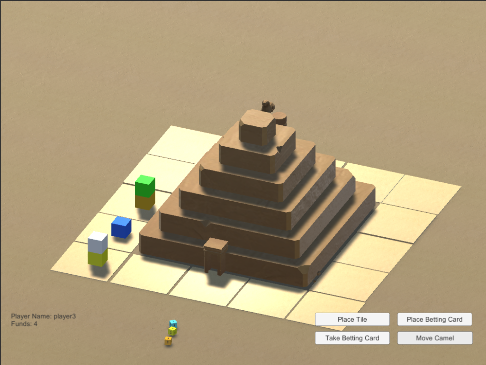
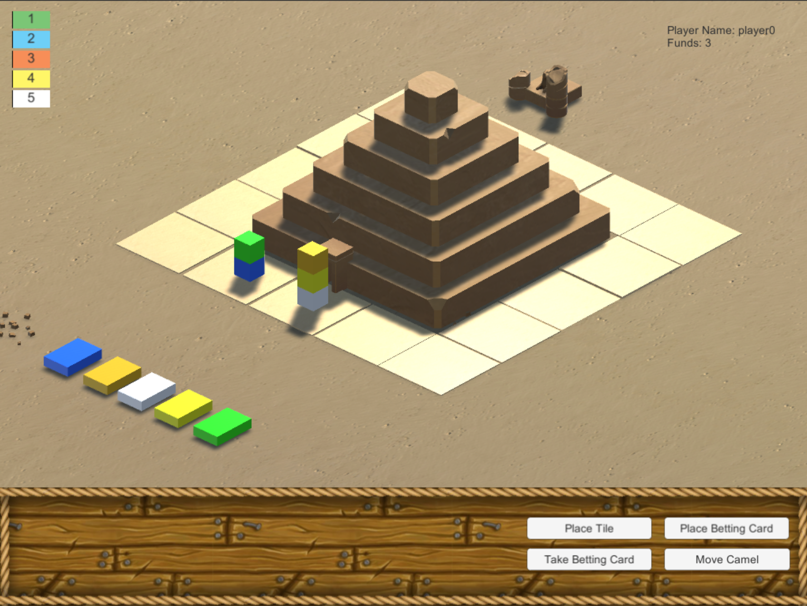
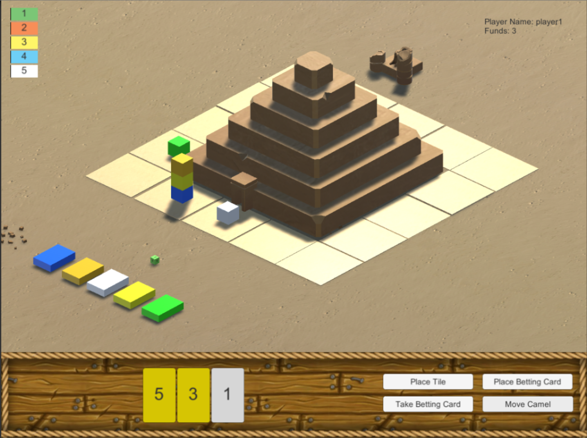

# Camel Up
A recreation of board game Camel Up (originally published by Pegasus Spiele, https://goo.gl/4gCSxA) using C# and Unity 2017. 

## Progress Update #1

The movement mechanics of the game have been sucessfully implemented, this includes a rolling 5 coloured dice independently and moving the coloured "camel" around the course, if a camel lands on the same square as another it stacks on top. When a camel moves it takes with it all camels above it.

## Progress Update #2

All the mechanics of the game (such as betting on each round of play and placing bonus tiles) have been implemented along with some rudimentary UI. I got stuck a few months ago as I needed to understand more about C# (IEnumerators especially). Currently the game can only be played by 4 real players. Hopefully when I learn more about creating AI I can code some opponents to play against. I would also like to revisit the models used once I have learned some more about 3D modelling and also add some animation to make the game feel more interactive.

The initial scene loaded when the game starts

After a few rounds, some players have picked up round betting cards which can be cashed in once all the camels have moved

